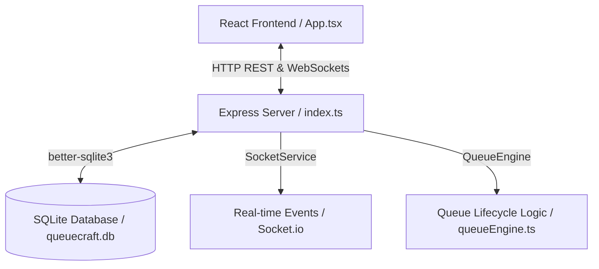

# QueueCraft: Smart Token and Queue Management System
## Repository & Architecture Inspection Report
**Developer Focus Module:** Administration + Authentication + Analytics (Prathamesh)

---

### A. Current Architecture
QueueCraft is a client-server web application constructed as a single repository containing:
1. **Frontend Client**: Built with **React 19** (Vite-powered Dev Server), **TypeScript**, **React Router Dom 7** for routing, and **Socket.io-client** for real-time bi-directional synchronization. Styling utilizes **Vanilla CSS** tokens, custom layout variables, and custom theme parameters for a sleek, responsive dark mode UI. Icons are imported from **Lucide-React**.
2. **Backend Server**: Constructed using **Express (Node.js)** with **TypeScript** and run with `tsx` watchers. It manages REST API endpoints and leverages **Socket.io** to dispatch real-time events to connected clients.
3. **Database Layer**: Built using **better-sqlite3**, running locally as a persistent, single-file SQLite database (`queuecraft.db`). It employs SQLite transactions to prevent race conditions during token creation and state changes.



---

### B. Current Folder Structure
```
TR01/
├── index.html                  # Frontend HTML shell
├── package.json                # Project dependencies and script endpoints
├── package-lock.json           # Locked dependencies definitions
├── tsconfig.json               # TypeScript configuration parameters
├── vite.config.ts              # Vite configurations (includes dev proxy settings)
├── server/                     # Backend Source Code
│   ├── index.ts                # Express server bootstrapper & socket configuration
│   ├── db/
│   │   ├── database.ts         # database connection, WAL & FK configuration
│   │   ├── schema.ts           # SQLite SQL schemas and tables construction
│   │   └── seed.ts             # Demo and mock seed statements
│   ├── middleware/
│   │   └── auth.ts             # Authentication JWT verification and RBAC checks
│   ├── routes/
│   │   ├── auth.ts             # User login and session recovery endpoints
│   │   └── staffQueue.ts       # Staff-only queue operations (dashboard, call next, complete, skip)
│   ├── services/
│   │   ├── queueEngine.ts      # State machine and queue algorithms (FCFS/FIFO priority logic)
│   │   └── socketService.ts    # Socket Room and connection events gateway
│   └── tests/
│       └── staffQueue.test.ts  # Vitest database and API integration tests
└── src/                        # Frontend React Source Code
    ├── main.tsx                # Client bootstrapper entry point
    ├── App.tsx                 # Core router and AuthContext/SocketContext provider wraps
    ├── index.css               # Global styling file (CSS variables, buttons, modals, dark theme style)
    ├── types/
    │   └── index.ts            # Core TypeScript interface, enum, and class definitions
    ├── context/
    │   ├── AuthContext.tsx     # Session management (login, logout, active token cache)
    │   └── SocketContext.tsx   # Socket.IO connection client hook
    ├── pages/
    │   ├── LoginPage.tsx       # Secure login page and demo login buttons
    │   └── StaffDashboardPage.tsx # Counter operations console (serves, holds, skips tokens)
    └── components/             # Reusable UI Components
        ├── CounterStatusToggle.tsx # Counter state lifecycle controller (OPEN, CLOSED, etc.)
        ├── CurrentTokenCard.tsx   # Display and operation center of currently active token
        ├── Header.tsx             # Main top navigation header and connection indicators
        ├── QueueStatsCards.tsx    # Live widgets for waiting list counts, hold list, served counts
        ├── ToastNotification.tsx   # Feedback micro-alerts system
        ├── TokenDetailsModal.tsx  # Detailed token history log overlay
        └── WaitingQueueList.tsx   # List of active students in line and Call Next triggers
```

---

### C. Existing Features
1. **Interactive Staff Operations Console**: Active dashboard for staff operators allowing:
   - Call next token in line.
   - Complete, hold, resume, and skip operations.
   - Live elapsed-time counter tracking how long the current student has been served.
2. **Real-time Live Syncing**: Real-time event notifications via WebSockets instantly update queue states and stats across all screens, utilizing room channels (`counter:ID`, `service:ID`).
3. **Priority Queue Ordering**: Priority scheduler where `HIGH` priority tokens (e.g., urgent tickets) bypass regular `NORMAL` tokens, sorted by First-Come-First-Serve (`created_at`) within priority levels.
4. **Counter Lifecycle Controller**: Dropdown status modifier toggling counters between `OPEN`, `CLOSED`, `BUSY`, and `MAINTENANCE`.
5. **Secure Authentication Hook**: Authentication flow with JSON Web Tokens (JWT) stored in LocalStorage, maintaining reactive users in React contexts.

---

### D. Existing Database Entities/Schema
The SQLite schema defined in [schema.ts](file:///c:/Users/USER/Desktop/gitrush/TR01/server/db/schema.ts) exposes:
- **`users`**:
  - `id` (TEXT, PK): Unique ID.
  - `name` (TEXT): Core user name.
  - `email` (TEXT, Unique): Credentials entry email.
  - `password_hash` (TEXT): Salted password credentials.
  - `role` (TEXT): Enforces `('STUDENT', 'STAFF', 'ADMIN')`.
  - `created_at` (DATETIME): Timestamp.
- **`services`**:
  - `id` (TEXT, PK): Core service ID (e.g., `'srv-lp'`).
  - `name` (TEXT): Display name (e.g., `'Library Printer'`).
  - `code` (TEXT, Unique): Service shortcode prefix (e.g., `'LP'`).
  - `description` (TEXT): Information text.
  - `created_at` (DATETIME): Creation stamp.
- **`counters`**:
  - `id` (TEXT, PK): Counter identifier.
  - `service_id` (TEXT, FK): Reference to `services.id`.
  - `name` (TEXT): Counter console tag (e.g., `'Printer Counter 1'`).
  - `status` (TEXT): Current state: `('OPEN', 'CLOSED', 'BUSY', 'MAINTENANCE')`.
  - `assigned_staff_id` (TEXT, FK): Active operator reference to `users.id`.
  - `created_at` (DATETIME): Creation stamp.
- **`tokens`**:
  - `id` (TEXT, PK): Unique ticket transaction ID.
  - `token_number` (TEXT): Generated identifier format (e.g., `'LP-041'`).
  - `student_id` (TEXT, FK): Booking student customer ID.
  - `student_name` (TEXT): Name fields.
  - `student_email` (TEXT): Email addresses.
  - `service_id` (TEXT, FK): Service queue category identifier.
  - `counter_id` (TEXT, FK): Processing counter station.
  - `priority` (TEXT): Enum: `('NORMAL', 'HIGH')`.
  - `status` (TEXT): State machine: `('WAITING', 'SERVING', 'HELD', 'COMPLETED', 'SKIPPED', 'CANCELLED')`.
  - `created_at` (DATETIME): Booking enqueue timestamp.
  - `started_at` (DATETIME): Service start timestamp.
  - `completed_at`, `skipped_at`, `held_at` (DATETIME): Lifecycle transition timestamps.
  - `notes` (TEXT): Input reasons or comments.

---

### E. Existing API Endpoints
All existing API endpoints are defined in Express routes:
- **Authentication (`/api/auth/*`)** in `routes/auth.ts`:
  - `POST /login`: Validates email/password, issues JWT token, and returns user/counter metadata.
  - `GET /me`: Authenticates active header JWT and sends active user details.
- **Queue Operations (`/api/staff/*`)** in `routes/staffQueue.ts` (Requires Role `STAFF` + active counter assignment):
  - `GET /dashboard`: Gathers active dashboard state (serving tokens, waiting queues, stats).
  - `GET /counter`: Return details of assigned counter.
  - `GET /counter/queue`: Retrieves service's active waiting queue.
  - `GET /tokens/:tokenId`: Retrieves complete metadata of specified token.
  - `POST /counter/next`: Calls next waiting eligible token (transitions status `WAITING` -> `SERVING`).
  - `POST /tokens/:tokenId/complete`: Marks a serving token as `COMPLETED`.
  - `POST /tokens/:tokenId/hold`: Places currently serving token on `HELD`.
  - `POST /tokens/:tokenId/resume`: Resumes a `HELD` token back to `SERVING`.
  - `POST /tokens/:tokenId/skip`: Skips serving token.
  - `PATCH /counter/status`: Toggles counter status between active states.
- **System Health (`/api/health/*`)** in `server/index.ts`:
  - `GET /`: Health verify returns OK and timestamps.

---

### F. Existing Authentication/Authorization
1. **JWT Verification**: Token validation middleware (`authenticateToken`) decodes user credentials, user ID, name, email, and designated role from the authorization header bearer component.
2. **Role-Based Access Control (RBAC)**: Checked via `requireRole(['ROLE_NAME'])` middleware.
3. **Assigned Counter Restriction**: Staff routes have the `requireCounterAssignment` filter. This checks which counter in the database has the staff's ID as `assigned_staff_id`. If nothing is found, it sends a `403 Forbidden` error.

---

### G. Existing Routes/Pages
1. **/login** (`LoginPage.tsx`): Authenticates staff credentials. Includes a demo login selector for user Rudresh.
2. **/staff** (`StaffDashboardPage.tsx`): Contains the counter lifecycle, statistics widgets, serving card, waiting queue list, and timeline modals.
3. *** (Catch-all)**: Automatically redirects unmatched requests to `/staff`.

---

### H. What is Already Implemented for Admin
1. **Database Schema Support**: The `role` column in the `users` table already accepts `'ADMIN'` values.
2. **Demo User Support**: Database seed command (`npm run seed`) setups a root admin demo user:
   - **Email**: `admin@queuecraft.edu`
   - **Password**: `password123`
3. **Application Routing Safeguard**: `App.tsx` redirects or renders if the authenticated role is `'ADMIN'` or `'STAFF'`:
   - `if (user?.role !== 'STAFF' && user?.role !== 'ADMIN') { // Block }`

---

### I. What is Missing for Admin Module (To be Built)
Prathamesh's assigned Administration, Authentication, and Analytics module requires implementing the following features:
1. **Admin Console UI & Pages**:
   - Administrative Dashboard (`/admin` and sub-paths) structured with an admin sidebar layout.
   - User Management Pages: Create, read, update, delete (CRUD) operations for system operators, staff accounts, and credentials.
   - Service Management Area: CRUD setup for services (e.g. creating Library Printers, transcribing counters, changing service codes).
   - Counter Station Configurator: Create, delete, and configure client booths/counters, and assign/unassign staff of corresponding departments.
   - Main Live Monitor: A multi-service overall monitor viewing all counters, service loads, queue sizes, and current status in real time.
2. **Authentication Route Separation**:
   - Redirection logic: Admin sessions must redirect to `/admin`, and staff sessions should load `/staff`.
   - Separate API router (`server/routes/admin.ts`) bound to `requireRole(['ADMIN'])`.
3. **Analytics Dashboard Interface & Metrics**:
   - Advanced operational analytics visuals (e.g., queue size patterns, peak-hour distributions, operator speed indices, skipped-to-completed ticket ratios).
   - Interactive charts and date-range filters (using chart systems or clean CSS analytics widgets).

---

### J. Recommended Files/Components to Modify or Create
No files will be modified or created in this step, but the recommended target actions for the next phase are:
1. **Backend Additions**:
   - Create `server/routes/admin.ts`: Houses router actions for admin tasks (managing services, counters, staff, and analytics queries).
   - Edit `server/index.ts`: Register `/api/admin` backend route.
2. **Frontend Additions**:
   - Create `src/pages/AdminDashboardPage.tsx`: Primary container routing to sub-sections (Services, Counters, Staff management, Live view).
   - Create `src/components/AdminSidebar.tsx`: Navigation sidebar for admin views.
   - Create `src/components/AnalyticsCharts.tsx`: Analytics charts and graph widgets.
3. **Frontend Infrastructure Modifications**:
   - Edit `src/App.tsx`: Create `/admin/*` protected route wrapping React view states. Update redirect paths inside LoginPage to route users according to their login role (`ADMIN` -> `/admin`, `STAFF` -> `/staff`).

---

### K. Potential Integration Points
1. **Atharva (Smart Queue Engine)**:
   - When an Admin creates/deletes a Service or Counter, the change must dynamically bubble into the `queueEngine` singleton instance without restarting the application.
2. **Rudresh (Staff Dashboard Page)**:
   - Admin panel alters counter assignments (changing `assigned_staff_id`). The changes must immediately update the active staff dashboards and send WebSocket state updates.
3. **Sujal (Student Booking Component)**:
   - Admins creating or closing services directly changes sujal's active booking screens (students cannot book a closed service).
4. **Pranay (Digital Signage / Displays)**:
   - Real-time updates to services and counters by admins will dictate the visual layout on public signage screens.

---

### L. Risks or Conflicts to Resolve
1. **Immediate Crash for Admin on `/staff` Redirect**:
   - Currently, an `ADMIN` user logging in is redirected to `/staff`. However, the `/api/staff/*` endpoints require both a `STAFF` role and a counter assignment (`requireCounterAssignment`). Since the Admin possesses neither, the page fails with a `403 Forbidden` API error. This must be resolved by implementing a split-route loader or early redirect in `App.tsx`.
2. **Mock Database Seeds Conflicts During Concurrent Branch Mocking**:
   - As team members test features, database structures or custom scripts in `seed.ts` could conflict. Schema changes should be coordinated to avoid locking sqlite records.
3. **Real-time Event Namespace Pollution**:
   - Admin actions (creating a service/counter) and staff actions (calling tokens) use the same Socket.IO layer. Event names must be cleanly namespaced (e.g. `admin:service_created`, `queue:token_called`) to avoid unexpected UI updates.

---

*Report prepared for QueueCraft prototype phase. Stop and await further instruction.*
